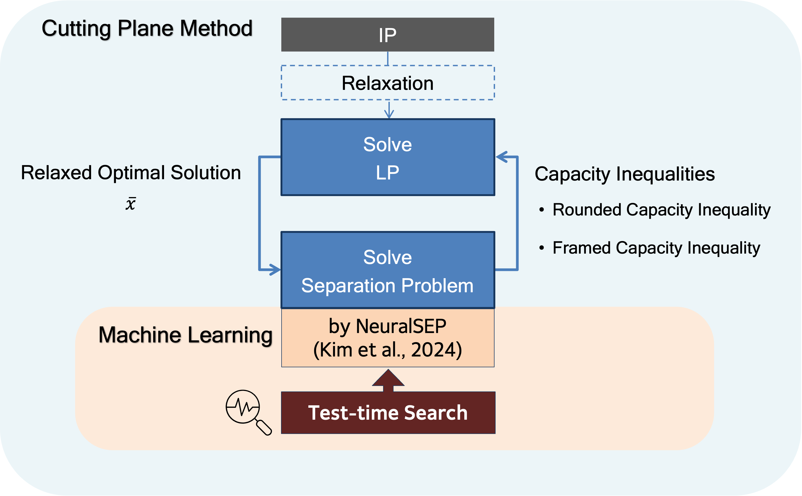

# Test-Time Search in Neural Graph Coarsening Procedures for the Capacitated Vehicle Routing Problem
This repository contains the implementation of our neural separation method for the Capacitated Vehicle Routing Problem (CVRP), enhanced with test-time search techniques for improved cut generation.


### Advanced Version of *A Neural Separation Algorithm for the Rounded Capacity Inequalities* (Kim et al.)
This version introduces three major improvements:
1. **Graph Neural Network Framework**  
   Migrated from the Deep Graph Library (DGL) to **PyTorch Geometric (PyG)**, providing better scalability.

2. **Stochastic Graph Coarsening**  
   Added a stochastic element on the graph coarsening procedure, which increases the number of Rounded Capacity Inequalities (RCIs) discovered.

3. **Graph Coarsening History-based Partitioning (GraphCHiP) Algorithm**  
   Developed the **GraphCHiP** algorithm, enabling the detection of additional RCIs as well as **Framed Capacity Inequalities (FCIs)** that could not be identified by previous method.
 

## 📦 Requirement
### Python requirement
Clone project and create an environment with conda:
```bash
conda create -n neuralsep_pyg python=3.9
conda activate neuralsep_pyg

conda install pytorch torchvision torchaudio pytorch-cuda=12.1 -c pytorch -c nvidia
conda install pyg -c pyg
conda install pytorch-sparse pytorch-scatter -c pyg
pip install -r requirements.txt
```

If you have any problem to install pyg, please try `pip install torch_geometric` or see [here](https://pytorch-geometric.readthedocs.io/en/latest/notes/installation.html).


### Julia requirement
Julia >= 1.9.3 is required.
```bash
conda activate neuralsep_pyg
julia
```

```julia
julia> ENV["PYTHON"] = Sys.which("python")
julia> ENV["PYCALL_JL_RUNTIME_PYTHON"] = Sys.which("python")
julia> ENV["CPLEX_STUDIO_BINARIES"] = "[cplex_dir]/cplex/bin/x86-64_linux/"
]
pkg> add PyCall
pkg> build PyCall
pkg> add CPLEX
pkg> build CPLEX
pkg> add JuMP TSPLIB CVRPLIB Graphs Pickle
pkg> add https://github.com/chkwon/CVRPSEP.jl
```

**Note:** 
- A license for CPLEX is required. You can download a free student licence [here](https://www.ibm.com/kr-ko/products/ilog-cplex-optimization-studio).
- Before add CPLEX, you need to install CPLEX and set the path: `ENV["CPLEX_STUDIO_BINARIES"] = "[cplex_dir]/cplex/bin/x86-64_linux/"`
- To use the created python env, activate the env and re-configure PyCall when installing PyCall in julia.


## ⚙️ Options
### Cut Options
The following configuration is set inside `config/options.toml`.

Scripts `src/solve_random_instances.jl` and `src/solve_X_instances.jl` automatically read this file and use the options.

```toml
[cut_options]
use_exact_rounded_capacity_cuts   = false   # Enable exact algorithm for RCI 
use_learned_rounded_capacity_cuts = true    # Enable NeuralSEP for RCI 
use_learned_framed_capacity_cuts  = true    # Enable GraphCHiP for FCI
use_rounded_capacity_cuts         = false   # Enable CVRPSEP for RCI
use_framed_capacity_cuts          = false   # Enable CVRPSEP for FCI

[search_options]
use_pi_greedy     = true   # Enable π-greedy selection
use_graphchip_rci = true   # Enable GraphCHiP for RCI
```
For detailed code for test-time search, see:
- `utils/graph_utils.py`: π-greedy selection for RCI
- `utils/graphchips.py`: GraphCHiP algorithm for RCI and FCI


## ▶️ Run
Make sure the datasets are prepared, then run the command. The procedure may vary by the type of problems.
### 1. Solve random instances
Pre-generated CVRP instances are already in `data/instances`, which are the same as in [neuralsep](https://github.com/hyeonahkimm/neuralsep/tree/main/data/instances).
```bash
cd src/jl
julia solve_random_instances.jl
```

### 2. Solve X instances (Uchoa et al, 2024)
Download the benchmark instances of Uchoa et al. (2024) from [CVRPLIB](https://vrp.galgos.inf.puc-rio.br) and put it to the `data/X` folder.
```bash
cd src/jl
julia solve_X_instances.jl
```
This will execute experiments using the predefined cut and search options above.


## 😃 Acknowledgements
This work builds upon https://github.com/hyeonahkimm/neuralsep.